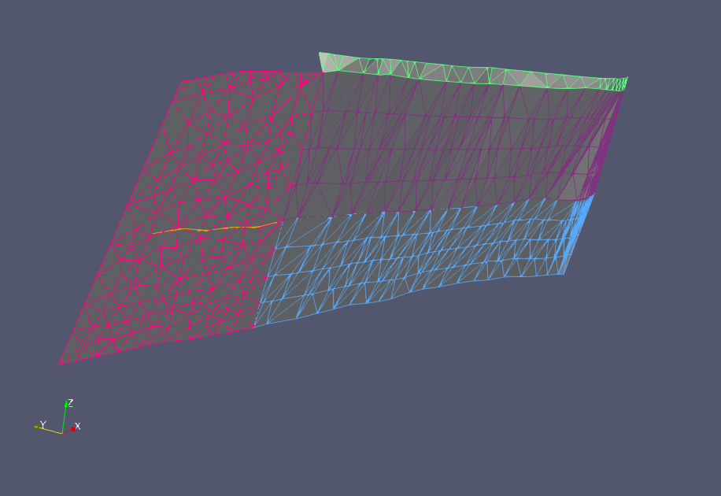

# Splinefit

Experimental python package for building a geometric description of a small subset of the [Community Fault Model](https://scec.usc.edu/scecpedia/CFM) using BSplines.

Currently, only a developer version of this software exists. Go to [dev](dev/)
to learn what it can do and how to use it. A detailed description of it does in a step-by-step fashion is explained in the [documentation](docs/) 

# Installation
```bash
$ git clone https://github.com/ooreilly/splinefit
$ pip install .
```

# Command line tools

## Convert GOCAD tsurf to gmsh
Use `tsurfmsh` to convert a triangular mesh stored in the `.ts` file format to the gmsh `.msh` file format. 
```bash
$ tsurfmsh (input) (output)

```
If the `.tsurf` file contains multiple surfaces, `tsurfmesh` will save one
surface per file. The surfaces are labelled as `output_0`, `output_1`, in the
order in which the surfaces are listed in the `.ts` file.

## Convert gmsh to vtk
Use `mshvtk` to convert a triangular mesh stored in the `.msh` file format to
the VTK legacy file format
```
$ mshvtk (input) (output)
```


View of a couple of fault surfaces in Paraview. The input files were first
converted from `.ts` to `.msh`, and then to `.vtk`.


# Tests
The directory `splinefit/tests` contains a series of tests that can be run using [pytest](https://docs.pytest.org/en/latest/)
```bash
$ pytest splinefit/tests
```
To ensure that some test data can be found it is important that the tests are run from the root directory as indicated above.
The tests are also useful to study to see examples of how to use different the modules.

