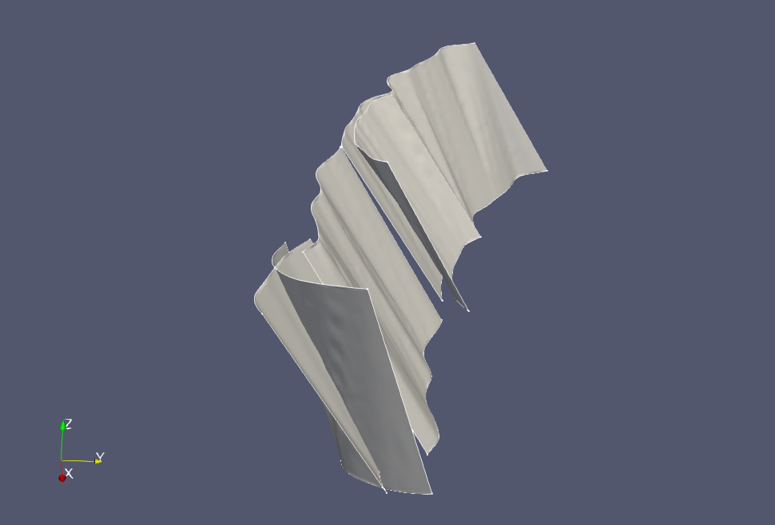

# Splinefit (BETA 1.0)

This package  is designed to construct CAD geometries of the regularized meshes
found in the [Community Fault Model](https://scec.usc.edu/scecpedia/CFM). 
Below
is an example of a fault zone geometry that been generated using this package. 



For more examples and tutorials, please visit the
[splinefit-examples](https://github.com/ooreilly/splinefit-examples) package.

# Dependencies
This package has the following dependencies:
* [Python](https://python.org) 3.6+.x 
* [scipy](https://www.scipy.org/) >=1.1 (linux) 1.1 (OS X)
* [numpy](https://www.numpy.org/) 
* [matplotlib](https://www.matplotlib.org/)
* [pyIGES](https://github.com/Rod-Persky/pyIGES)
* [pytest](https://docs.pytest.org/en/latest/) (to run tests)

## OS X
There is a known issue with later versions of scipy that causes a segmentation
fault on certain OS X systems, see: [#9571](https://github.com/scipy/scipy/issues/9751)
As a work-around, install scipy version 1.1:
```bash
$ pip3 install scipy==1.1 --user
```

# Installation
The [pyIGES](https://github.com/Rod-Persky/pyIGES) package is currently not available in the Pypi index. Install it by
cloning the repository:
```bash
$ https://github.com/Rod-Persky/pyIGES.git
$ cd pyIGES
$ pip3 install . --user
```

Once all dependencies have been installed, the package can be installed via:
```bash
$ git clone https://github.com/ooreilly/splinefit
$ cd splinefit
$ pip3 install . --user

``` 

