# BSpline surface fitting
In this document, we explain how to fit a BSpline surface to an initial surface
model that is defined by a point cloud and a triangulation. For this example, we
will focus on the *West Garlock fault*, which belongs to the easy
category. A view of the mesh for this fault geometry is shown in Figure 1.

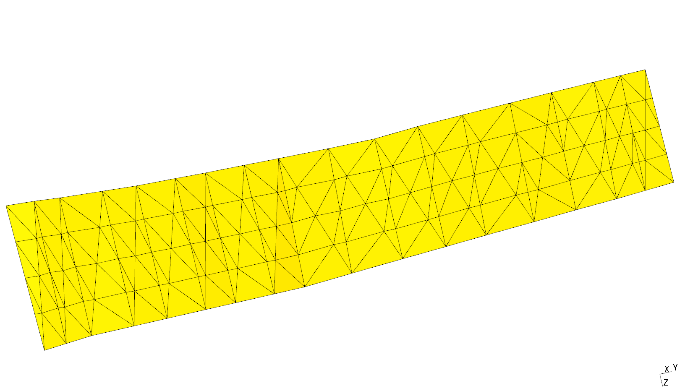
**Figure 1**: Initial mesh for the West Garlock fault.


## Outline of fitting procedure
The faults in the community fault model and the ones that have been selected for
testing out the automatic meshing procedure have a variety of different
features. Some faults are simple and can be described by a single rectangular
plane, other faults are draped like curvy carpets, and may also be defined by
multiple intersecting segments or faults with holes. Despite many of these
complexities it seems like a first initial assumption is to view each fault as a
collection of surfaces that can be mapped to a rectangular path in 2D space.
With this assumption in mind, we can formulate a simple strategy for performing
the fitting. This procedure outline below, will be the first thing to try and
evaluate. It is designed to be the simplest procedure that I can think of and 
that I believe while have some chance at succeeding. 

These are the key components to the surface fitting, 

1. [Boundary detection](#boundary-detection)
2. [2D Plane projection](#2d-plane-projection)
3. [2D Plane rotation](#2d-plane-rotation)
4. [Quadrilateral fitting](#quadrilateral-fitting) (deprecated)
5. [Boundary segmentation](#boundary-segmentation)
6. [BSpline boundary curve fitting](#bspline-boundary-curve-fitting)
7. Surface parameterization
8. BSpline surface fitting

Below follows an overview of what each step does.

In the first step, the goal is to detect the nodes and edges that lie on the
boundary of the domain. The boundary should form a closed loop. Under the
assumption that the boundary can be mapped to the edges of a rectangle, it is
broken up into four segments, mapping to each side of the rectangular patch
(left, right, top, bottom). It is also quite possible that there are multiple
boundaries in the same mesh. These other boundaries could be internal ones if
there are holes in the surface, or if there are multiple surfaces. For now, we
will ignore these complications.

After that the boundary has been detected and segmented, it is projected onto
the best fitting 2D plane. This plane is simply found by performing principal
component analysis (PCA) and defining the plane using the eigenvectors
corresponding to the two maximum modulus eigenvalues.

## Boundary detection
Altough there probably are plenty of packages that can be used to detect the
boundary of some triangulation, I decided to implement my own solution. It
appears that many of the meshes contain multiple surfaces. For now, only one
surface is treated. Figure 2 shows the boundary detection method in action. Finding the additional surfaces in the
triangulation is simply of matter rerunning the algorithm on the mesh after haviing removed the first boundary detected,
and then repeating the process until no more boundaries are detected.


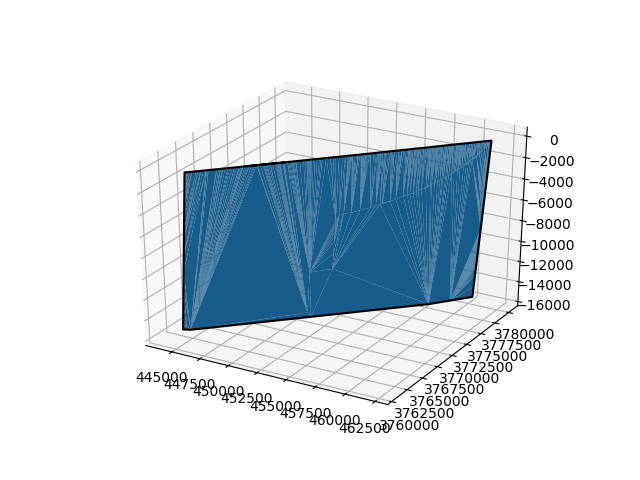
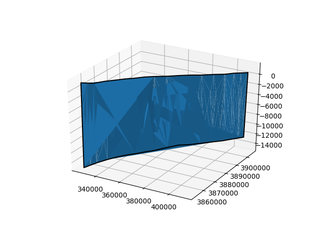
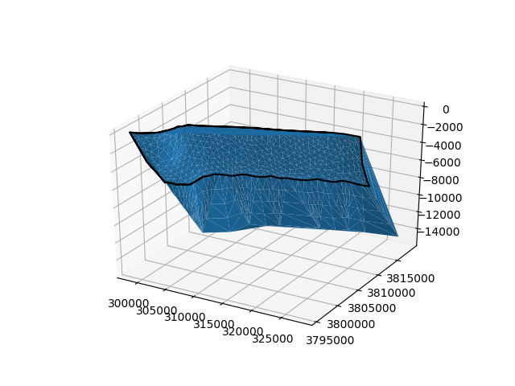

**Figure 2** : Detection of boundary edges (and nodes) of the faults in the easy
list. The strange looking surface of some meshes is an artifact of the
renderer. The last example (San Cayetano fault) contains multiple surfaces. Only
the first detected surface will be treated for now.

The way the boundary detection works is by noting that an edge lies on the
boundary of the mesh if this edge only appears in a single triangle. Edges that
are shared by two triangles are interior edges. Once the boundary edges have
been detected, they are ordered by starting at some arbitrary boundary node and
then selecting the next node by looking for its nearest neighbor, and by
excluding itself or a previous node from the search. The search terminates when
a previously visited node is revisited. 

It is possible, and in fact, some meshes contain multiple boundaries. The
multiple boundaries come from having multiple surfaces in the same file, or come
from hole structures.


## 2D Plane Projection
After boundary detection, the boundary points are projected onto the best fitting plane. While there is a some global origin
defined for the entire point cloud, a new coordinate system is introduced which defines its origin as a point on the plane. This change of coordinates simplifies the construction of the plane.
This new origin is defined by taking the mean of the coordinates of the boundary points . In addition, each point on the
boundary is
renormalized using the standard deviation. The plane to use for the projection is computed by using principal component
analysis (PCA). The two eigenvectors that are paired with the two eigenvalues of largest and sencod largest eigenvalues are
selected as the basis vectors that span the plane. Naturally, the eigenvector corresponding to the eigenvalues of
smallest magnitude defines the normal to this plane. The reason why PCA has been chosen for selecting this plane is
because this method finds the plane that minimizes the orthogonal distance from the plane to the boundary points. Once the plane has been found, its basis vectors are used to project the boundary points onto the best fitting plane.

Figure 3 shows the basis vectors defining the plane, and the projection of the boundary onto the plane.

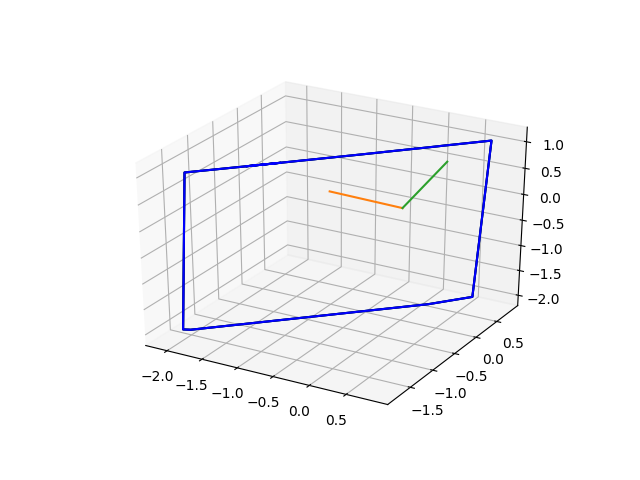 
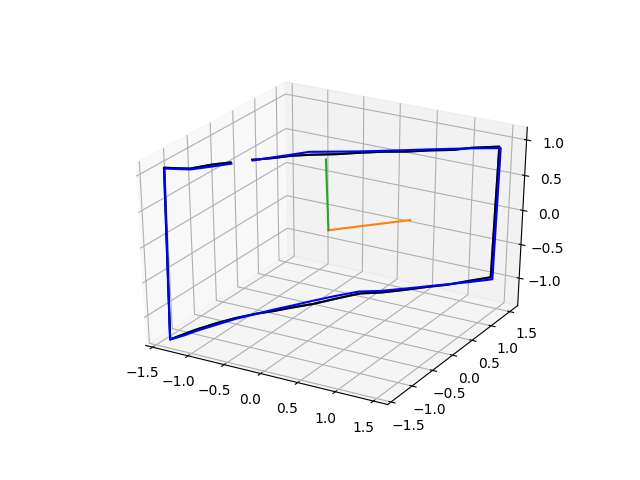
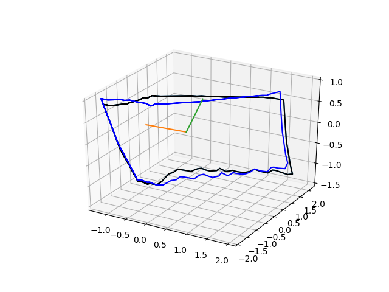

**Figure 3:** Projection of boundary points (black) onto the best fitting plane (blue). The orange and green lines show
the basis vectors spanning the plane. The gap in the boundary is because it is not plotted as closed loop. This issue
will be addressed in the near future. 

## 2D Plane rotation
Once the boundary has been projected onto the best fitting plane it is rotated
to align with the coordinate axes. The purpose of this rotation is to make sure
that the data is better aligned with the UV grid that will be covered by BSpline
basis functions. Also, this rotation makes it easier to identity each boundary
segment (described in the next step). To perform the rotation, the points
defining the boundary segments are rotated about their mean coordinate. The
angle of rotation is computed using a simple unconstrained optimization
procedure (Nelder-Mead). In this optimization procedure, the area of the
bounding box is chosen as the objective function. Figure 4 shows the initial
bounding box before finding the optimal rotation (blue) and after applying the
optimal rotation (red) that approximately minimizes the area of the bounding box.

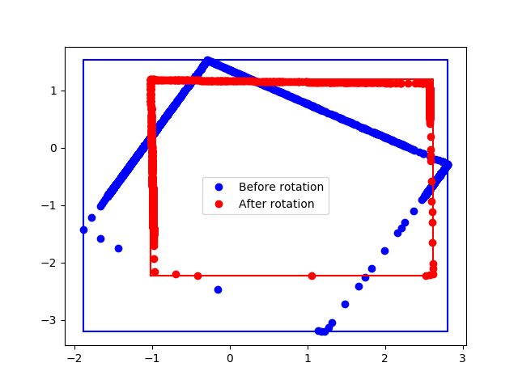 
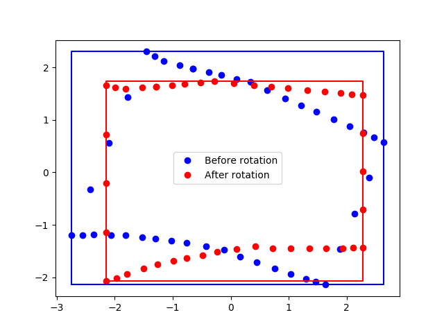
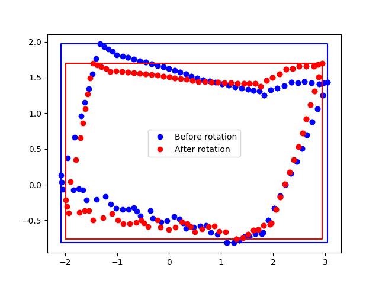

**Figure 4:** Rotation of projected boundary so that it aligns with the
coordinate axes.

### Quadrilateral fitting
**WARNING:** This step is not working correctly. It must either be improved or
removed.

The purpose behind this step is to obtain a better fit by reshaping the bounding box into 
quadrilateral. This quadrilateral can then be used to identify corner points by
picking the boundary points that lie closest to the vertices of the
quadrilateral. Unfortunately, this step is currently quite slow and also not
very robust. To obtain the quadrilateral, a nonlinear constrained optimization
problem needs to be solved. The objective function is defined as the minimum of
area of the quadrilateral or triangle that can be generated using any three
vertices. The reason for defining the objective function in this way is to
prevent the optimization procedure from trying to minimize the area of the
quadrilateral by collapsing it into a triangle. The minimization of the area
is constrained by requiring that all boundary points lie inside the
quadrilateral. Figure 5 shows the result of applying this optimization
procedure. As can be seen in the figure, the optimization fails for the third
test case (Southern San Cayetano fault). An additional test case is included,
featuring a fault from the medium dataset. This fault is not so easily to map to
a plane and the fitting a quad to it - its projection lacks clear edges.


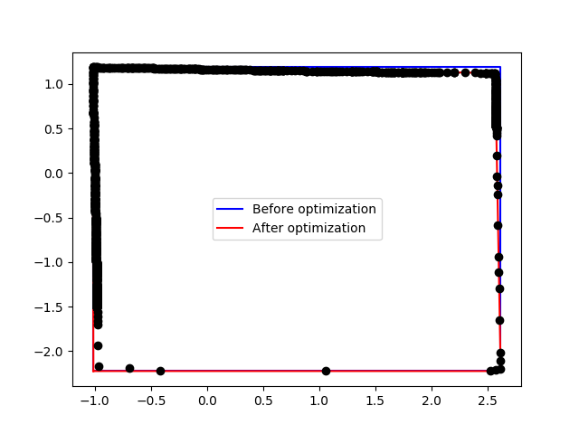 
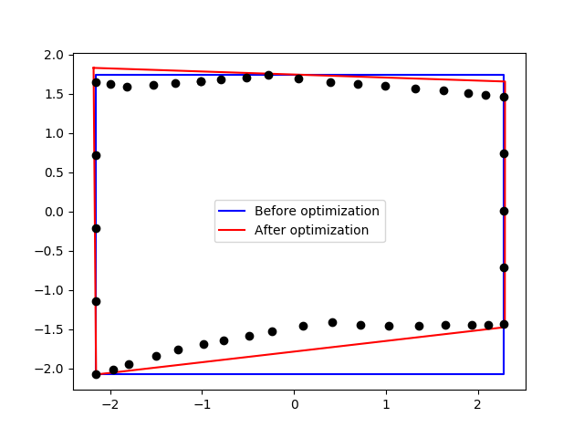
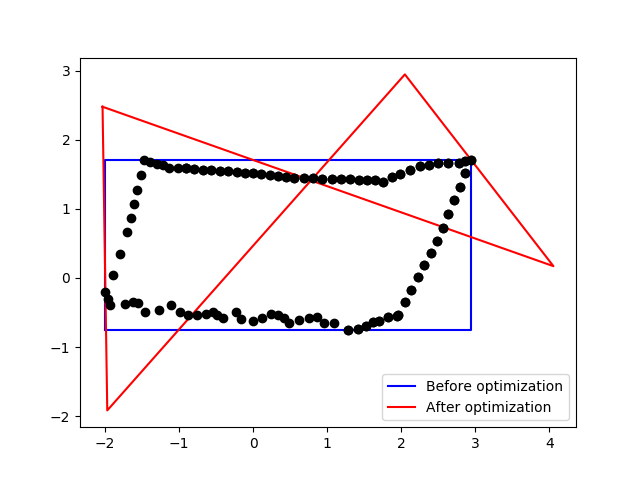
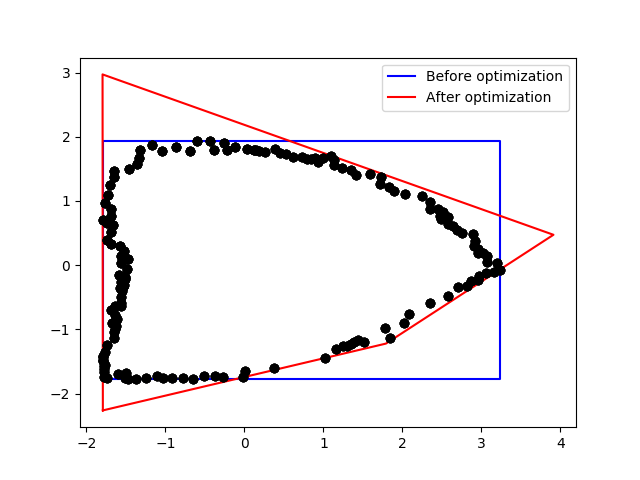

**Figure 5:** First attempt at finding a minimum area quadrilateral that
encloses all boundary points.

### Boundary segmentation

While the quadrilateral step is currently not working, boundary segmentation
using the bounding box information works quite well.  Corner points are selected
by finding the boundary points that are the closest to each vertex of the
bounding box in the L1 norm. Once the corner points have been selected, the
boundary segments can easily be extracted for each side. Figure 6 shows the
result of applying the boundary segmentation step to some of the faults.

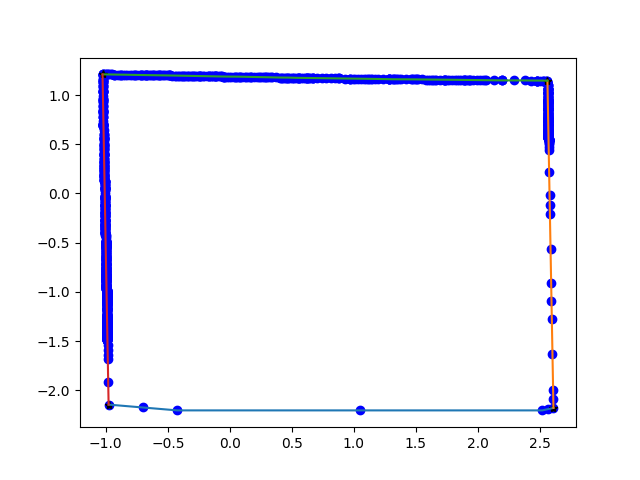 
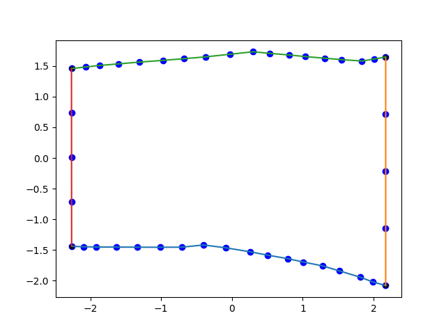
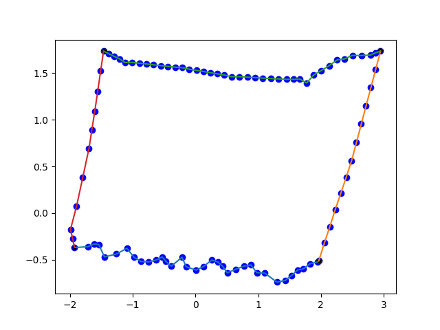
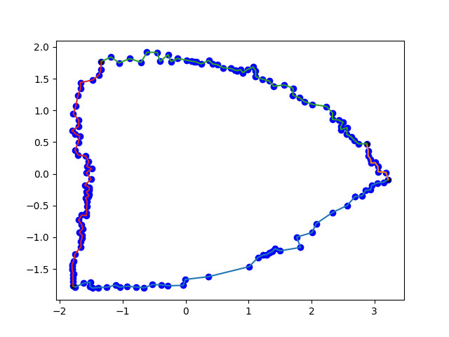

**Figure 6:** Detection of corner points using L1 distance and boundary
segmentation.

### BSpline boundary curve fitting

A BSpline curve `C(s) = sum_i B_i C` is fitted to each of the boundary segments extracted in the
previous step. To perform the fit, a mapping between each data point `(x,y)` and
the arclength parameter `s`, satisyfing `0 <= s <=1`, is defined. The mapping
used is the L2 distance between two neighboring data points and the previous
parameter value. For example, `P_0 = (x_0, y_0)` maps to `s_0 =0`, and `P1 =
(x_1, y_1)` maps to `s_1 = s_0 + dist(P_0, P_1)` and so forth. Once all mapping
values have been defined, they are normalized to `0 <= s <= 1`. The position
of knots, or breakpoints for the curve are taken to be uniform. The control
points of the curve are chosen by minimizing `\sum _i ||C_x(s_i) - x_i||^2`
for the x-components and similarily for the y-components. 

A free parameter in the procedure is the number of knots to use. The more knots
used, that more flexibility is gained, but also the risk of introducing unwanted
oscillations, and overfitting is increased. To find a suitable number of knots
to use, a wide range of knots is tried until the residual of the least squares
fit reaches some predetermined threshold.

Below are some figures showing the BSpline curves obtained by running the
procedure for each of the boundary segments obtained in the previous step. 

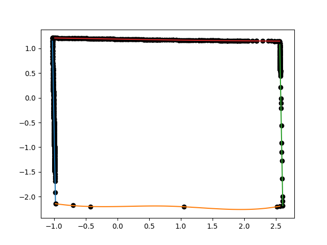 
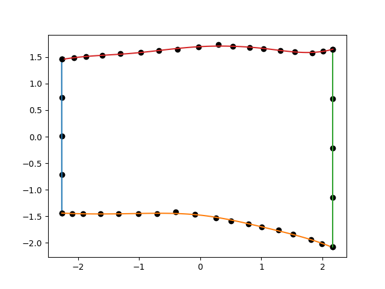
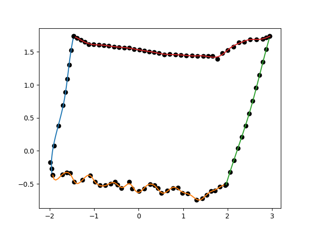
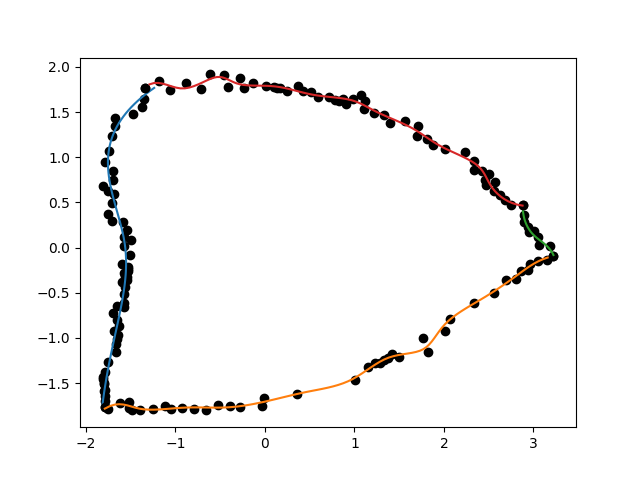

**Figure 7:** BSpline curves fitted to each boundary segment.

Some more work is needed to make the fitting procedure more robust. A little bit
of manual labor is needed to set a good threshold. Some attempts resulted in
instability. There are also some divide by zero errors that can arise in the
BSpline basis evaluation. 


**Example program output**
```
python3 bspline-boundary.py data/test/WTRA-ORFZ-SFNV-Northridge-Frew_fault-CFM2_segment.p data/test/WTRA-ORFZ-SFNV-Northridge-Frew_fault-CFM2_bspline-boundary.p 3 0.4 figures/test/WTRA-ORFZ-SFNV-Northridge-Frew_fault-CFM2_bspline-boundary.png
Determining number of u-knots...
Iteration: 1, number of interior knots: 1, residual: 0.678383
Iteration: 2, number of interior knots: 3, residual: 0.631804
Iteration: 3, number of interior knots: 5, residual: 0.564876
Iteration: 4, number of interior knots: 7, residual: 0.540487
Iteration: 5, number of interior knots: 9, residual: 0.521067
Iteration: 6, number of interior knots: 11, residual: 0.476231
Iteration: 7, number of interior knots: 13, residual: 0.446917
Iteration: 8, number of interior knots: 15, residual: 0.432751
Iteration: 9, number of interior knots: 17, residual: 0.403929
Iteration: 10, number of interior knots: 19, residual: 0.364851
Determining number of v-knots...
Iteration: 1, number of interior knots: 1, residual: 0.423652
Iteration: 2, number of interior knots: 3, residual: 0.365569
Number of UV control points: [7, 23]
```
