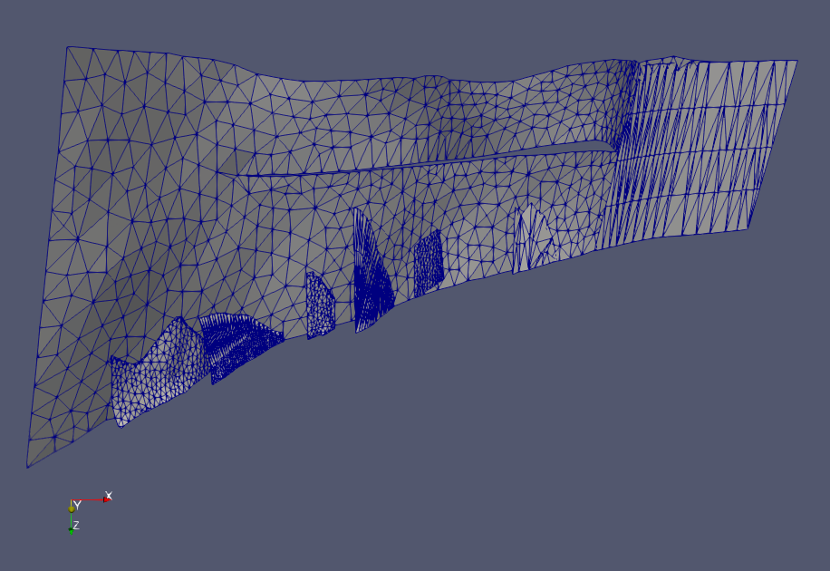
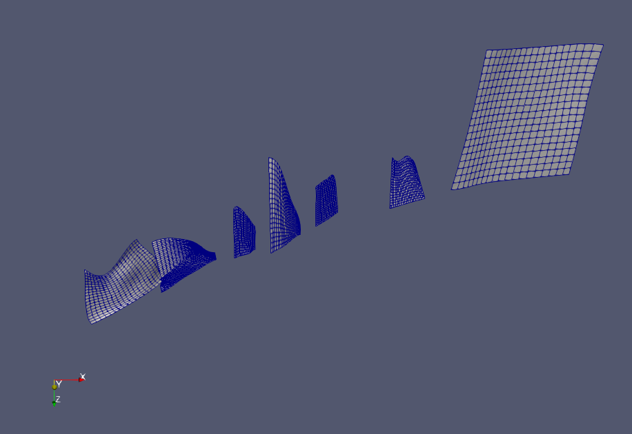
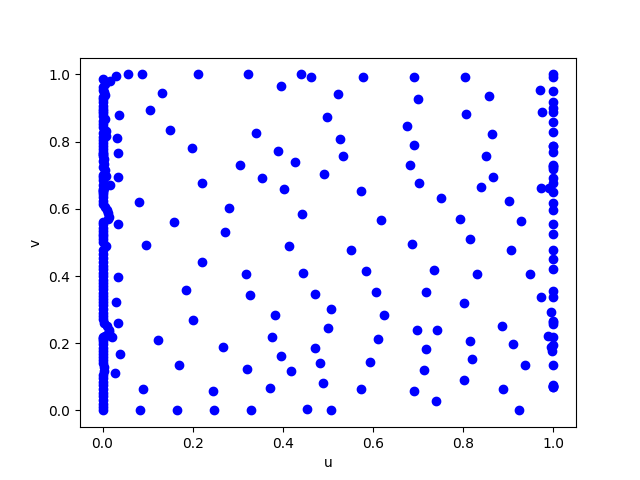
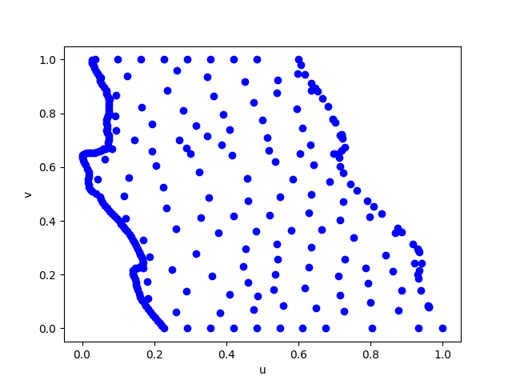
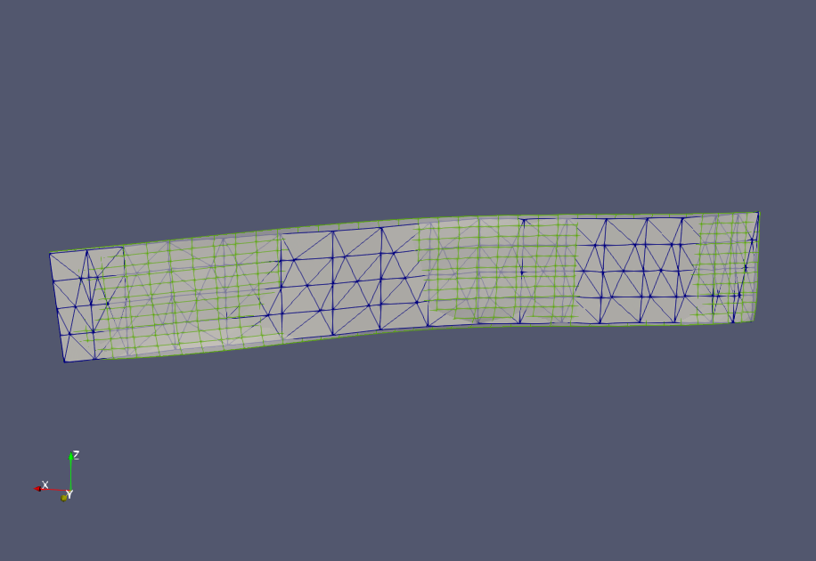
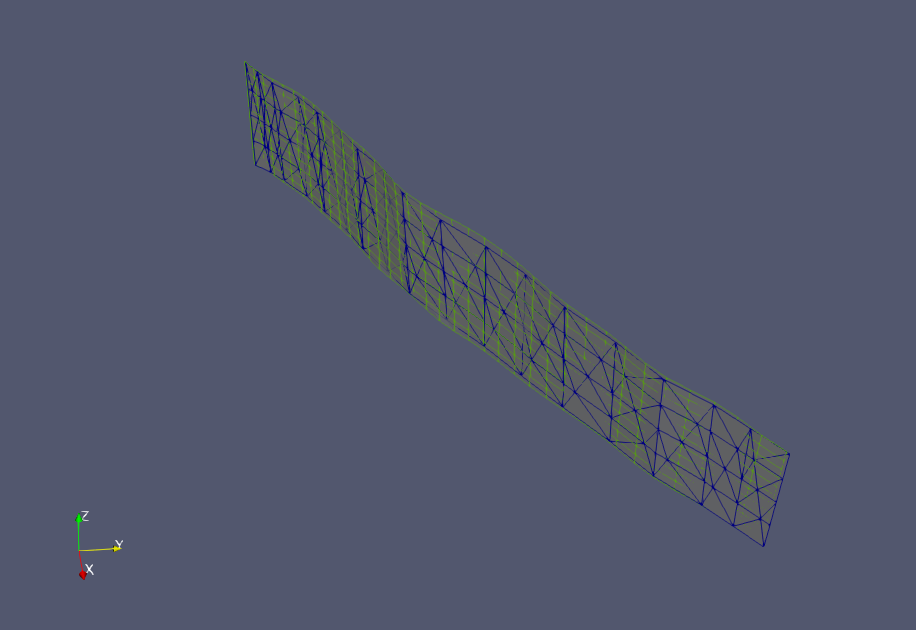
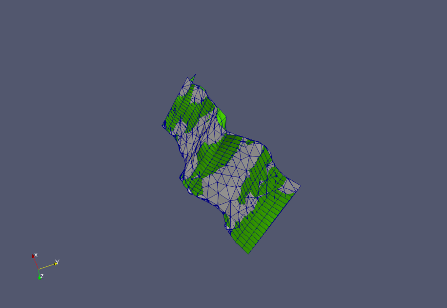
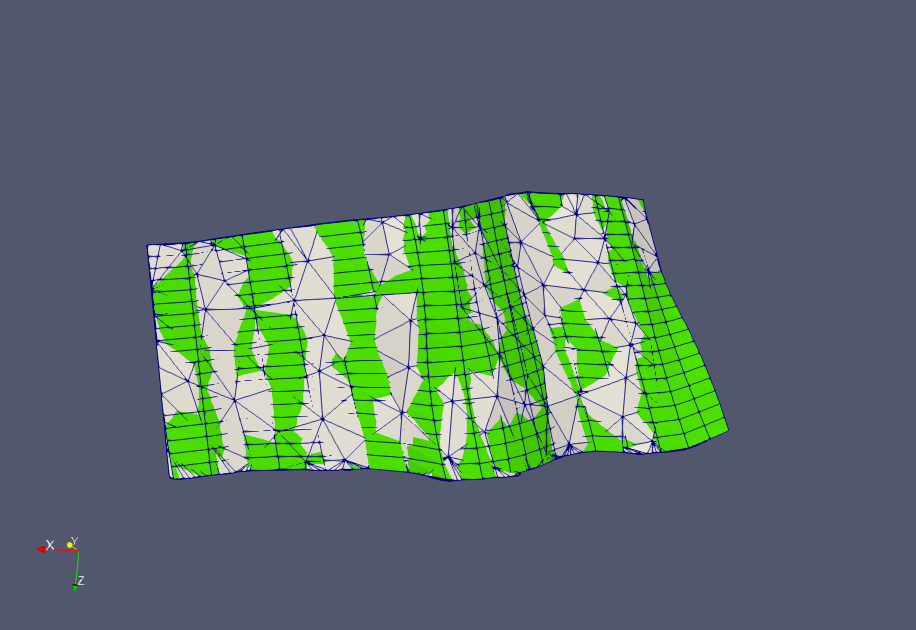

# BSpline surface fitting
This document explains how to fit a BSpline surface to triangulated fault
surfaces in the community fault model. The faults in the community fault model,
and in particular the ones that have been selected for the pilot study, have a
variety of different features. Some faults are simple and can be described by a
single rectangular plane, other faults are draped like curvy carpets, and may
also be defined by multiple intersecting segments or faults with holes. A lot
of this complexity is captured in the Newport-Inglewood fault. The original
geometry is shown in Figure 1a, and the current BSpline surface fit for this
geometry is shown in Figure 1b. The current version of the software cannot
handle surfaces with holes correctly, which explains why a large part of the
model is missing.


**Figure 1a**: Initial mesh of the Newport-Inglewood fault.


**Figure 1b**: BSpline surface fit of the Newport-Inglewood fault.

## Outline of fitting procedure

Despite many of these
complexities, a first initial assumption is to view each fault as a
collection of surfaces that can be mapped to a rectangular path in 2D space.
With this assumption in mind, we can formulate a simple strategy for performing
the fitting. This procedure is outlined below.

1. [Boundary detection](#boundary-detection)
2. [2D Plane projection](#2d-plane-projection)
3. [2D Plane rotation](#2d-plane-rotation)
4. [Boundary segmentation](#boundary-segmentation)
5. [BSpline boundary curve fitting](#bspline-boundary-curve-fitting)
6. [Surface parameterization](#bspline-surface-parameterization)
7. [BSpline surface fitting](#bspline-surface-fitting)

## Boundary detection
Although there probably are plenty of packages that can be used to detect the
boundary of some triangulation, I decided to implement my own solution. It
appears that many of the meshes contain multiple surfaces. To simplify matters,
each surface is written to its own file when converting from `.ts` to `.msh`.
The `.msh` files are labelled as `mesh_0.msh`, `mesh_1.msh`, etc. Here, `mesh_0`
contains the first surface found in the `.ts` file.

Figure 2 shows the boundary detection method in action. 


**Figure 2** : Detection of boundary edges (and nodes) of the faults in the easy
list. The strange looking surface of some meshes is an artifact of the
renderer. The last example (San Cayetano fault) contains multiple surfaces. Only
the first detected surface will be treated for now.

The way the boundary detection works is by noting that an edge lies on the
boundary of the mesh if this edge only appears in a single triangle. Edges that
are shared by two triangles are interior edges. Once the boundary edges have
been detected, they are ordered by starting at some arbitrary boundary node and
then selecting the next node by looking for its nearest neighbor, and by
excluding itself or a previous node from the search. The search terminates when
a previously visited node is revisited. 

It is possible, and in fact, some meshes contain multiple boundaries. The
multiple boundaries come from having multiple surfaces in the same file, or come
from hole structures.


## 2D Plane Projection
After boundary detection, the boundary points are projected onto the best fitting plane. While there is a some global origin
defined for the entire point cloud, a new coordinate system is introduced which defines its origin as a point on the plane. This change of coordinates simplifies the construction of the plane.
This new origin is defined by taking the mean of the coordinates of the boundary points . In addition, each point on the
boundary is
renormalized using the standard deviation. The plane to use for the projection is computed by using principal component
analysis (PCA). The two eigenvectors that are paired with the two eigenvalues of largest and sencod largest eigenvalues are
selected as the basis vectors that span the plane. Naturally, the eigenvector corresponding to the eigenvalues of
smallest magnitude defines the normal to this plane. The reason why PCA has been chosen for selecting this plane is
because this method finds the plane that minimizes the orthogonal distance from the plane to the boundary points. Once the plane has been found, its basis vectors are used to project the boundary points onto the best fitting plane.

Figure 3 shows the basis vectors defining the plane, and the projection of the boundary onto the plane.

 


**Figure 3:** Projection of boundary points (black) onto the best fitting plane (blue). The orange and green lines show
the basis vectors spanning the plane. The gap in the boundary is because it is not plotted as closed loop. This issue
will be addressed in the near future. 

## 2D Plane rotation
Once the boundary has been projected onto the best fitting plane it is rotated
to align with the coordinate axes. The purpose of this rotation is to make sure
that the data is better aligned with the UV grid that will be covered by BSpline
basis functions. Also, this rotation makes it easier to identity each boundary
segment (described in the next step). To perform the rotation, the points
defining the boundary segments are rotated about their mean coordinate. The
angle of rotation is computed using a simple unconstrained optimization
procedure (Nelder-Mead). In this optimization procedure, the area of the
bounding box is chosen as the objective function. Figure 4 shows the initial
bounding box before finding the optimal rotation (blue) and after applying the
optimal rotation (red) that approximately minimizes the area of the bounding box.

 


**Figure 4:** Rotation of projected boundary so that it aligns with the
coordinate axes.


## Boundary segmentation

While the quadrilateral step is currently not working, boundary segmentation
using the bounding box information works quite well.  Corner points are selected
by finding the boundary points that are the closest to each vertex of the
bounding box in the L1 norm. Once the corner points have been selected, the
boundary segments can easily be extracted for each side. Figure 6 shows the
result of applying the boundary segmentation step to some of the faults.

 


**Figure 6:** Detection of corner points using L1 distance and boundary
segmentation.

## BSpline boundary curve fitting

A BSpline curve `C(s) = sum_i B_i C` is fitted to each of the boundary segments extracted in the
previous step. To perform the fit, a mapping between each data point `(x,y)` and
the arclength parameter `s`, satisyfing `0 <= s <=1`, is defined. The mapping
used is the L2 distance between two neighboring data points and the previous
parameter value. For example, `P_0 = (x_0, y_0)` maps to `s_0 =0`, and `P1 =
(x_1, y_1)` maps to `s_1 = s_0 + dist(P_0, P_1)` and so forth. Once all mapping
values have been defined, they are normalized to `0 <= s <= 1`. The position
of knots, or breakpoints for the curve are taken to be uniform. The control
points of the curve are chosen by minimizing `\sum _i ||C_x(s_i) - x_i||^2`
for the x-components and similarily for the y-components. 

A free parameter in the procedure is the number of knots to use. The more knots
used, that more flexibility is gained, but also the risk of introducing unwanted
oscillations, and overfitting is increased. To find a suitable number of knots
to use, a wide range of knots is tried until the residual of the least squares
fit reaches some predetermined threshold.

Below are some figures showing the BSpline curves obtained by running the
procedure for each of the boundary segments obtained in the previous step. 

 


**Figure 7:** BSpline curves fitted to each boundary segment.

Some more work is needed to make the fitting procedure more robust. A little bit
of manual labor is needed to set a good threshold. Some attempts resulted in
instability. There are also some divide by zero errors that can arise in the
BSpline basis evaluation. 


**Example program output**
```
python3 bspline-boundary.py data/test/WTRA-ORFZ-SFNV-Northridge-Frew_fault-CFM2_segment.p data/test/WTRA-ORFZ-SFNV-Northridge-Frew_fault-CFM2_bspline-boundary.p 3 0.4 figures/test/WTRA-ORFZ-SFNV-Northridge-Frew_fault-CFM2_bspline-boundary.png
Determining number of u-knots...
Iteration: 1, number of interior knots: 1, residual: 0.678383
Iteration: 2, number of interior knots: 3, residual: 0.631804
Iteration: 3, number of interior knots: 5, residual: 0.564876
Iteration: 4, number of interior knots: 7, residual: 0.540487
Iteration: 5, number of interior knots: 9, residual: 0.521067
Iteration: 6, number of interior knots: 11, residual: 0.476231
Iteration: 7, number of interior knots: 13, residual: 0.446917
Iteration: 8, number of interior knots: 15, residual: 0.432751
Iteration: 9, number of interior knots: 17, residual: 0.403929
Iteration: 10, number of interior knots: 19, residual: 0.364851
Determining number of v-knots...
Iteration: 1, number of interior knots: 1, residual: 0.423652
Iteration: 2, number of interior knots: 3, residual: 0.365569
Number of UV control points: [7, 23]
```
## BSpline surface parameterization
Currently, The spline surface parameterization is simply done by mapping data
points to the nearest `(u, v)` coordinates in the plane. It should be possible to
improve this mapping by inverting the actual mapping function, 
This mapping function comes from applying transfinite interpolation in the
plane. Essentially what is currently done is that the curved grid
lines in the interior of the surface are obtained by applying linear
transfinite interpolation in the plane, using the boundary curves obtained in the previous
step. 

The transfinite interpolation technique gives us a mapping between points in
space `(x(u,v),y(u,v),0)` on the surface. The z coordinate is here set to zero
because the interpolation is carried out in the plane. The forward mapping is easy to
compute, that is given `(u,v)` determine `(x,y,0)`. The inverse mapping requires
a nonlinear solver. The inverse problem is: given a point `(x,y,0)` on the
surface find its parameterization `S(u,v)`.  


## Inverse mapping
The figure below shows the mapping of each `(x,y)` point in the plane
to `(u,v)` space. Note that the points on the top and bottom boundary are not
properly mapped. However, since it is known what points are on the boundaries,
the mapping for the boundaries can be adjusted.



**Figure 8** U-V mapping of Santa Susana fault data by inverting the transfinite
interpolation map. 



**Figure 9** U-V mapping of Santa Susana fault data by normalizing x and y
coordinates. 


## BSpline surface fitting
By specifying the control point coordinates `(Px, Py)` in the plane using the mapping
function, all that remains is to specify the `Pz`. To explain the first poin in
more detail, `(Px, Py)` are chosen
to coincide with the `x,y` coordinates computed from the transfinite
interpolation when evaluating the boundary curves at the knots. To specify `Pz`,
a linear least square fit is performed. After the fitting is completed, the
surface is rotated and translated back to the original coordinate system. Figure
8 and 9 show the original surface and the fitted bspline surface using two
different thresholds.

The output of applying this procedure is in most cases highly unreliable, but
do in some cases generate a surface that resembles the original surface.
Needless to say, more work is needed, and several improvements are underway.


**Figure 10** Initial BSpline surface fit obtained for the Garlock fault geometry
shown in Figure 1. The slightly transparent surface rendered with a green
wireframe is the BSpline surface evaluated using `37 x 12` grid points.
Threshold: `0.2`.


**Figure 11** Improved BSpline surface fit (c.f. Fig. 9) that has been obtained
by adjusting the boundary fitting threshold slightly. Threshold: `0.01`.


**Figure 12** Bspline surface fit obtained for one part of the Santa Susana
fault geometry. The U-V mapping is naively constructed (see [inverse
mapping](#inverse-mapping)). The green mesh is the fitted surface.

**Figure 13** Bspline surface fit obtained for one part of the Santa Susana
fault geometry. The U-V mapping is constructed by inverting the transfinite
interpolation map (see [inverse mapping](#inverse-mapping)). The green mesh is
the fitted surface.

